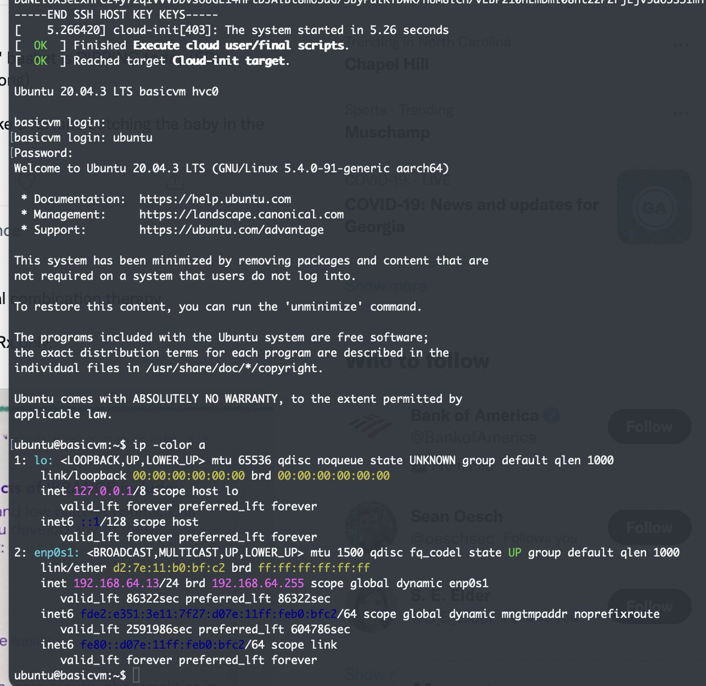

# slim | [](https://travis-ci.org/ottomatica/slim)

`slim` will build a VM from a Dockerfile. Slim works by building and extracting a rootfs from a Dockerfile, and packaging a corresponding kernel and initrd into a desired image.

This results in a real VM that can boot instantly, while using very limited resources.

## Using slim

The following are a few ways you can use slim to build VM images.

### Create a custom Alpine RAM only VM Image

1. Provide a Dockerfile and custom init script.

See [images/alpine3.12-raw](images/alpine3.12-raw).

2. Build initrd and kernel.

```bash
$ slim build images/alpine3.12-raw
...
$ ls -lh ~/.slim/registry/alpine3.12-raw         
-rw-r--r--  1 cjparnin  staff    22M Jan  2 20:50 initrd
-rw-r--r--  1 cjparnin  staff   4.6M Dec 28 11:22 vmlinuz
```

### Build a Ubuntu Focal Cloud Raw VM Image 

1. Provide a Dockerfile `images/ubuntu-20.04-cloud-init`

```Dockerfile
FROM ubuntu:20.04 AS kernel
RUN apt-get update && \
    apt-get install -y linux-virtual && \
    apt-get clean

FROM ubuntu:20.04

# Extract the kernel, modules, and initrd
COPY --from=kernel /lib/modules /lib/modules
COPY --from=kernel /boot/vmlinuz-* /vmlinuz
COPY --from=kernel /boot/initrd.img-* /initrd

RUN apt-get update 
# Needed for configuring server and setting up devices.
RUN apt install cloud-init udev kmod -y
# If you'd like to be able to ssh in:
RUN apt install openssh-server sudo -y
```

2. Extract an initrd, rootfs, and uncompressed kernel.

```
$ slim build images/ubuntu-20.04-cloud-init
...
$ ls -lh ~/.slim/registry/ubuntu-20.04-cloud-init
-rw-r--r--  1 cjparnin  staff    16M Jan  2 17:37 initrd
-rw-r--r--  1 cjparnin  staff   512M Jan  2 19:24 rootfs
-rw-------@ 1 cjparnin  staff    29M Nov  5 12:04 vmlinuz
```

3. Provide a user-data and meta-data file to customize VM.

```
$ slim cloudinit images/ubuntu-20.04-cloud-init
...
$ ls -lh ~/.slim/registry/ubuntu-20.04-cloud-init
-rw-r--r--  1 cjparnin  staff   366K Jan  2 21:19 cidata.iso
```


### Create a Hyper-V VHD Image

The following creates a Ubuntu Focal with cloud-init, but the necessary hyper-v kernel modules,
and bootable image for Microsoft's Hyper-V.

1. Provide a Dockerfile.

See [images/ubuntu-20.04-ci-hyperv](images/ubuntu-20.04-ci-hyperv).

2. Create a VHD disk drive (1G) with EFI bootable partition.

```
PS slim build images/ubuntu-20.04-ci-hyperv -f vhd -s 1024
...
PS ls ~/.slim/registry/ubuntu-20.04-ci-hyperv
-a----          1/2/2022   3:19 PM      738381824 rootfs.vhd
```

3. Provide a user-data and meta-data file to customize VM.

```
$ slim cloudinit images/ubuntu-20.04-ci-hyperv
...
$ ls -lh ~/.slim/registry/ubuntu-20.04-ci-hyperv
-a----          1/1/2022   3:32 PM         374784 cidata.iso
```


## Installing slim

Simply clone this repo, cd slim, and run:

```
npm install
npm link

# Pull docker images used for system dependencies.
slim init
```

You must have [docker](https://docs.docker.com/install/) on your system.